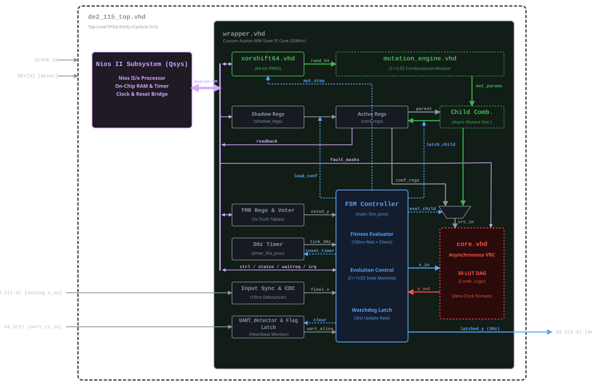

### CGP Self-Healing Watchdog

A hardware-based, self-healing watchdog implemented on an Altera Cyclone IV FPGA (Terasic DE2-115). It monitors a target device's heartbeat and triggers a hard power reset if the signal is lost. In the background, the system autonomously rewires its own internal logic via a Cartesian Genetic Programming (CGP) algorithm to bypass hardware faults.

The ambition behind this project was to take a step toward biologically-inspired, self-organizing hardware — an electronic system that rebuilds itself like a living organism. However, the Cyclone IV architecture does not support Dynamic Partial Reconfiguration (DPR). Without DPR, evaluating each new offspring would require resynthesizing and reprogramming the entire chip, including the modules executing the evolutionary algorithm. Therefore, the evolution process would have to be performed off-chip. To avoid this, instead of directly mutating the physical FPGA bitstream, a virtualized logic matrix was implemented. It provides a deterministic environment for the autonomous evolution engine to operate. An additional, critical advantage of this virtualization is speed, as the bitstream upload overhead is eliminated.

The core combinational logic runs on a [Virtual Reconfigurable Circuit (VRC)](core.vhd) — an unclocked matrix of 30 custom [LUT4Cell](LUT4Cell.vhd) nodes constituting a Directed Acyclic Graph (DAG). 

A [Synchronous Wrapper](wrapper.vhd) encapsulates the VRC, integrating the Avalon-MM slave interface, TMR reference oracle, sequential fitness evaluator, and [control FSM](doc/FSM.svg). It bridges the 50 MHz system clock with the 3 Hz control rate of the external analog RC circuit, executing real-time watchdog supervision (3 Hz) while concurrently driving background evaluations and the evolutionary repair loop (50 MHz).

### Key Architecture
* **Hardware-In-The-Loop (HIL):** A direct VHDL continuation of the [previous iCE40 VERILOG project](https://github.com/lgog2/icesugar-watchdog-cgp), moving from off-chip software evolution (loading only the final evolved genotype onto the FPGA) to real-time, on-chip hardware evaluation, fault injection, and autonomous hardware evolution.
* **Hardware-Software Co-Design:** The hardware watchdog (VRC and synchronous wrapper) operates autonomously as a custom Avalon-MM IP core. It is integrated with a Nios II softcore processor, which serves as a control tool, a fault-injection host, a telemetry logger, and a prototyping environment for evolutionary algorithms.
* **Dual-Mode Evolution Engine:** The system features two independent recovery mechanisms:
  * **Hardware (1+1)-ES:** A hardware-driven evolution loop executing background repair without external intervention. Powered by a [64-bit PRNG](xorshift64.vhd) and an asynchronous, combinatorial [Mutation Engine](mutation_engine.vhd) utilizing DSP multipliers (Lemire's Fast Scaling), it evaluates 1 offspring per generation in ~67 clock cycles (~1.34&nbsp;µs).
  * **Software (1+4)-ES:** A baseline C implementation running on the Nios II softcore processor, evaluating 4 offspring per generation in ~805&nbsp;µs (~201&nbsp;µs per offspring).
* **16.6M Cycle Evolution Window:** The FPGA runs at 50&nbsp;MHz, while the external RC circuit is controlled at 3&nbsp;Hz. This decoupling provides a 16.6-million-cycle (333&nbsp;ms) window for *in-situ* background evaluation and reconfiguration without blocking watchdog operations.
* **Massive Search Space & Graceful Degradation:** Besides rerouting flexibility, each of the 30 `LUT4Cell` nodes can be dynamically reprogrammed with any of the 65,536 (216) 4-input Boolean functions. This allows the discovery of unconventional logic structures and provides a mechanism for self-healing by exploiting the residual functionality of partially damaged nodes instead of replacing them as in classical redundancy schemes.

### Experimental Fault Injection Results

Preliminary hardware verification confirms that the system achieves **autonomous, real-time self-healing**, with the hardware `(1+1)-ES` engine recovering from faults **up to 307x faster than the Nios II software baseline**. Furthermore, the watchdog maintains continuous operation despite extreme structural degradation — individually surviving **100% LUT truth-table bit inversions (480/480)**, **~66% stuck LUT inputs (79/120)**, or **~67% stuck LUT outputs (20/30)**.

These results were obtained through 7 [Nios II fault injection tests](software/hardware_evolution_test/main.c) using three fault models:
* **PBI (Permanent Bit Inversion):** Bit-flips injected directly into the 16-bit `LUT4Cell` truth tables.
* **IN SA0/1 (Input Stuck-At-0/1):** Individual `LUT4Cell` inputs permanently tied to logic LOW or HIGH, restricting the node's active inputs.
* **OUT SA0/1 (Output Stuck-At-0/1):** `LUT4Cell` outputs permanently tied to logic LOW or HIGH, disabling the entire node.

#### 1. Comparative Benchmark: Software (1+4)-ES vs. Hardware (1+1)-ES (Test 1)
Compares single-event recovery time from an undamaged baseline across three fault scenarios: a stuck LUT output, a stuck LUT input, and concurrent Multiple Permanent Bit Inversions (MPBI) across three active LUTs ([Log](doc/test_logs/1_Comparative_Benchmark.txt)).

| Test 1 Scenario | SW (1+4)-ES Generations | SW Repair Time | HW (1+1)-ES Generations | HW Repair Time | HW Speedup |
| :--- | :---: | :---: | :---: | :---: | :---: |
| **1. LUT 0 Output Stuck-At-0** | `133` | `106.6 ms` (5.33M cycles) | `256` | `347 µs` (17.3k cycles) | **`~307x`** |
| **2. LUT 1 Input I0 Stuck-At-1** | `43` | `34.4 ms` (1.72M cycles) | `222` | `301 µs` (15.1k cycles) | **`~114x`** |
| **3. LUT 0, 1, 2 MPBI** | `291` | `234.5 ms` (11.73M cycles) | `2,414` | `3 238 µs` (161.9k cycles) | **`~72x`** |

#### 2. Cumulative Fault Tests: Hardware (1+1)-ES (Tests 2–7)
Probe the survival limits of the 30-LUT matrix under progressive fault accumulation across two injection regimes:
* **Active-DAG Targeting (Tests 2–3):** The Nios II host extracts the active phenotype and injects faults exclusively into utilized logic paths (`Active DAG`), granting a fresh 333&nbsp;ms repair window (`Reset`) after each strike until a fault fails to heal within this deadline.
* **Continuous Full-Matrix Injection (Tests 4–7):** Faults are injected randomly across the entire matrix (`Full Matrix`) every **15&nbsp;ms** — asynchronously to the ongoing hardware evolution and without resetting the 333&nbsp;ms window (`Cont.`). Each test draws from single-type or mixed (`16:4:1`) fault pools until the pool is exhausted or the system remains unrepaired for **5.0 consecutive seconds**.

| Test | Fault Pool | Target | 333&nbsp;ms Window | Absorbed Faults | Active LUTs | Log |
| :--- | :--- | :--- | :---: | :--- | :---: | :---: |
| **2. Cumul. IN** | `IN SA0/1` | Active DAG | Reset | **80** (`45 silent, 56%`) | `16/30` | [Log](doc/test_logs/2_Cumulative_Routing_SA.txt) |
| **3. Cumul. PBI** | `PBI` | Active DAG | Reset | **354** (`278 silent, 79%`) | `15/30` | [Log](doc/test_logs/3_Cumulative_Logic_PBI.txt) |
| **4. Cont. PBI** | `480` PBI | Full Matrix | Cont. | **480 / 480** (`100%`) | `15/30` | [Log](doc/test_logs/4_Continuous_PBI.txt) |
| **5. Cont. IN** | `120` IN SA0/1 | Full Matrix | Cont. | **79 / 120** (`66%`) | `18/30` | [Log](doc/test_logs/5_Continuous_Inputs_SA.txt) |
| **6. Cont. OUT** | `30` OUT SA0/1 | Full Matrix | Cont. | **20 / 30** (`67%`) | `9/30` | [Log](doc/test_logs/6_Continuous_Outputs_SA.txt) |
| **7. Cont. Mix** | `630` (16:4:1) | Full Matrix | Cont. | **237 / 630** (`184 PBI, 40 IN, 13 OUT`) | `14/30` | [Log](doc/test_logs/7_Continuous_Mix.txt) |

### Resource Utilization (Cyclone IV EP4CE115F29C7)
* **Total logic elements:** 11,122 / 114,480 (10%)
* **Total registers:** 5,460
* **Total memory bits:** 570,624 / 3,981,312 (14%)
* **Embedded Multiplier 9-bit elements:** 16 / 532 (3%)

### Physical Setup

A hybrid hardware system: a digital FPGA fabric operating alongside a custom-built analog circuit to monitor a target device.

* **Logic Processing Subsystem (Digital):** Terasic DE2-115 Development Board (Altera Cyclone IV E) hosting the watchdog components, a Nios II softcore, and an Avalon-MM interconnect. Interfaces with the analog circuit via 50&nbsp;MHz inputs (secured by 2-FF synchronizers and 10ms debouncers) and 3&nbsp;Hz latched outputs.
* **Custom Watchdog Peripheral (Analog):** A hand-soldered dual RC circuit:
  * **Dual Timers:** The continuous capacitor charging voltages feed directly into the FPGA's GPIOs to implement two physical time constants — `watchdog timeout` (heartbeat monitoring) and `reset hold time` (power-cut duration).
  * **Power Control:** Features an AQV252G solid-state relay driven by the FPGA's 3&nbsp;Hz control logic, cutting the 5V power supply to the target device upon watchdog intervention.
* **Oscilloscope Verification:** Mixed-signal waveforms captured at the FPGA–RC interface:
  * 🟡 **Yellow:** Voltage on the `watchdog timeout` capacitor.
  * 🟢 **Green:** Voltage on the `reset hold time` capacitor.
  * 🔵 **Blue:** Discharge control for the `watchdog timeout` capacitor, normally `LOW` (allowing charging), pulsing `HIGH` on valid heartbeats or at the end of a reset-hold cycle to re-arm the timer.
  * 🔴 **Red:** Discharge control for the `reset hold time` capacitor, held `HIGH` during normal operation to keep the capacitor discharged, dropping `LOW` upon timeout to initiate the power-cut interval.
* **Target Device & Asynchronous Heartbeat:** Supervises a NanoPi SBC (substituted during tests by an external yellow LED load indicator and a manual wire-loop heartbeat). The asynchronous 1.5&nbsp;Mbps UART heartbeat is captured and filtered at 50&nbsp;MHz by the [UART Detector](UART_detector.vhd), while the control signals are latched into the 3&nbsp;Hz analog domain.
* **Live Demonstration (Video):** Shows baseline operation. Two onboard red LEDs indicate the 3&nbsp;Hz operational cycle and heartbeat registration, while four green LEDs indicate capacitor states and discharge control signals.

>*[Detailed schematic of the external analog circuit and system integration.](doc/external_schematic.pdf)*

https://github.com/user-attachments/assets/a17d88b5-d474-4fec-8ac6-e5ef11028020

### Roadmap & Status

**Completed**
* Physical hardware interface operational (50&nbsp;MHz system clock bridged to the 3&nbsp;Hz analog control domain).
* Initial static validation completed using hardcoded DAG logic (3 LUTs out of 30) to prove external watchdog functionality.
* Nios II softcore integrated with a custom BSP, utilizing cascaded hardware multipliers (`mulxuu`) for Fast Range math optimization.
* Memory-mapped Avalon-MM interface implemented. Includes shadow registers (routing, logic, outputs) for VRC reconfiguration without data tearing, a dedicated control register (`control_reg`) for FSM execution modes/PRNG seeding, and a `waitrequest`-synchronized status register (`status_reg`) exposing hardware FSM flags (panic, repair) and current fitness to the Nios II processor.
* Full `(1+4)-ES` implemented in C on the Nios II processor, with execution time profiled via a dedicated Interval Timer IP.
* Autonomous hardware `(1+1)-ES` background evolution implemented, capable of self-contained, real-time failure recovery without CPU intervention.
* Hardware fault injection subsystem controlled from the Nios II processor: per-LUT fault-mask registers applying combinatorial `XOR`/`AND`/`OR` overlays directly in the logic matrix to emulate Permanent Bit Inversion, Stuck-At-0, and Stuck-At-1.
* Zero-cycle hardware Triple Modular Redundancy (TMR) integrated to protect the Nios-reconfigurable fitness truth table for the hardware evaluator.
* Software-based phenotype extraction implemented using reverse topological traversal and Boolean difference sensitivity analysis to identify structural and logically active DAG nodes and inputs.
* Comparative performance benchmarking and cumulative fault capacity verification completed across 7 fault injection tests.

**Future Exploration**
* Hardware Evolution Engine Extension (investigating multi-point mutation and alternative evolutionary algorithms).
* Dual Fault Tolerance (combining CGP with TMR at the VRC output level).
* Dynamic Partial Reconfiguration (DPR): Porting the system to a DPR-capable architecture to achieve direct reconfiguration without the VRC abstraction layer.
